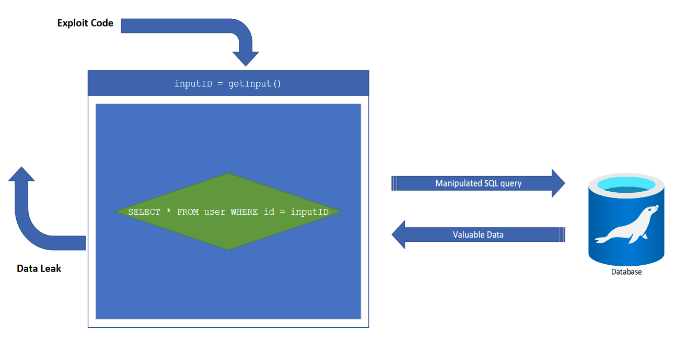

# SQL-Abfrage absetzen

Nachdem wir die Verbindung zum Server (mit Java anhand JDBC) aufgebaut haben, können SQL-Abfragen abgesetzt werden. 

## Query direkt absetzen

Ein erster Weg wäre, eine Query direkt abzusetzen. 

### Java

```java
String lastname = "Mair%";
String query = "SELECT Firstname, Lastname, Age, HeightInMeter FROM Person WHERE Lastname LIKE " + lastname;
try (Statement stmt = connection.createStatement()) { //zuerst anhand der Connection ein Statement erstellen
    ResultSet rs = stmt.executeQuery(query); // Mit der Statement-Methode executeQuery kann eine Query 1:1 ausgeführt werden
    while (rs.next()) {
        String firstName = rs.getString("Firstname");
        String lastName = rs.getString("Firstname");
        int age = rs.getInt("Age");
        float heightInMeter = rs.getFloat("HeightInMeter");
        System.out.println(firstName + ", " + lastName + ", " + age + ", " + heightInMeter);
    }
} catch (SQLException e) {
    System.err.println("Fehler bei der Datenbankabfrage");
    e.printStackTrace();
}
```

### C#

```csharp

```

## Datenbank-Exploit - Angriffe auf die Datenbank



Ein großer Nachteil der direkt abgesetzten Queries ist, dass der Einsatz von Variablen zu Sicherheitsproblemen führen kann, weil der Inhalt der Variablen insbesondere von Variablen des Typs String gegen **Code-Injection** nicht geschützt sind. Code-Injection könnte folgendermaßen aussehen: 

In die Variable *`lastname`* könnte man statt `"Mair%"` sondern z.B. `"'Mair%' OR NOT LIKE 'Mair%'"` und so liefert das Statement auf einmal alle Einträge der Tabelle, statt ausschließlich jene, die eigentlich abgefragt werden sollen. Stellen Sie sich vor, was da passiert, wenn eine solche Abfrage auf der User-Tabelle stattfindet, die alle Benutzer\*innen ihrer Website beinhaltet: Der\*die Angreifer\*in bekommt , alle vorhandenen Benutzer\*innen-IDs und vermutlich noch einige sensible Informationen über diese.


Wie man an diesem Beispiel erkennen kann, können Angreifer\*innen aufgrund nicht abgesicherter Statements vieles anrichten. 

Ein anderes Beispiel wäre, dass der\*die Angreifer\*in die gesamte Datenbank löscht oder einem anderen User Rechte vergibt, einen neuen User anlegt, mit dem weiter angegriffen werden kann.

Der Kern des Problems ist, dass Code und Daten vermischt werden müssen, um zum Ergebnis zu kommen. Den Code hat der Entwickler in der Hand, allerdings hat meist der\*die Anwender\*in (also der\*die Angreifer\*in) die eingegebenen Daten in der Hand. Dieses Thema findet man aber nicht nur in der Arbeit mit Datenbanken. Auch *`Makros in Office-Dokumenten`*, *`Javascript in HTML/PDF`* sind Beispiele davon, wo Code-Injection ins Spiel kommen kann.

Weiters ist es für produktive Applikationen unbedingt notwendig, die Rechte des Datenbankusers so einzuschränken, dass dieser nur das tun darf, was er wirklich können soll. Auch die Quelle, wo die Anfrage herkommen darf (lokal vs. Internet vs. bestimmte IP-Adressen) soll möglichst eingeschränkt werden.

Ein User, der lediglich in der Datenbank `Users` Lese- und Schreiboperationen durchführen soll, soll auch ausschließlich diese Rechte haben (also hierfür den root-User zu verwenden, stellt eine Sicherheitslücke dar, die Angreifer\*innen mehr Angriffsmöglichkeiten bietet). Man könnte soweit gehen, dass man für eine Applikation mehrere Datenbankuser erstellt, die je nach Anwendungsfall verwendet werden.

**Zusammengefasst**:

Es gibt viele mögliche Wege Daten so zu manipulieren, um entweder mehr Daten aus der Datenbank herauszubekommen oder Daten zu löschen bzw. zu verändern. 

Was kann man dagegen tun:
- Quoting und Escaping
- PreparedStatements (siehe nächstes Kapitel)
- [SQL Injection Prevention Cheat Sheet](https://cheatsheetseries.owasp.org/cheatsheets/SQL_Injection_Prevention_Cheat_Sheet.html)
- Datenbankuser hat genau jene Rechte, die er wirklich braucht!
- Datenbankuser darf sich ausschließlich von dort aus einloggen, wo er herkommen darf (localhost, bestimmte IP-Adresse)

## Prepared Statements absetzen

Um diese Gefahr zu entgehen gibt es eine spezielle Art von Statements: sogenannte **PreparedStatement**. Diese bestehen einerseits aus einem Statement mit Platzhaltern, andererseits aus Parametern, die gesondert eingefügt werden und dabei auf Code-Injection überprüft werden.

### Java

```java
try (PreparedStatement ps = connection.prepareStatement("SELECT Firstname, Lastname, Age, HeightInMeter FROM Person WHERE Lastname LIKE ?");) { // Definition des Statements
    ps.setString(1, "Mair%"); // Zuweisung der Parameter
    ResultSet rs = ps.executeQuery(); // Absetzen der Query
} catch (SQLException e) {
    System.err.println("Fehler bei der Datenbankabfrage");
    e.printStackTrace();
}
```

### C#

```csharp

```

## Ergebnis der Query verarbeiten

Das Ergebnis der Abfrage ist ein sogenanntes ResultSet. Man kann es sich wie eine Tabelle vorstellen, die ausgegeben wird. Den ResultSet wird folgendermaßen ausgelesen:
- zuerst wird auf die Zeile zugegriffen
- anschließend wird innerhalb der Zeile auf die einzelnen Spalten zugegriffen:
    - anhand des Spaltenindex (die Reihenfolge, wird durch den Request vorgegeben, wobei die erste Spalte den Index 1 hat) 
    - anhand des Spaltennamens (wie im Request angegeben) auslesen kann.

Wir erweitern jetzt das Beispiel von oben dementsprechend:

### Java

```java
try (PreparedStatement ps = connection.prepareStatement("SELECT Firstname, Lastname, Age, HeightInMeter FROM Person WHERE Lastname LIKE ?");) {
    ps.setString(1, "Mair%");
    ResultSet rs = ps.executeQuery();
    while (rs.next()){ // Zugriff auf die nächste Zeile, auch wenn das Ergebnis nur 1 Zeile hat!
        String firstName = rs.getString("Firstname"); // Zugriff auf die Spalte mit dem Namen "Firstname"
        String lastName = rs.getString("Lastname"); // Zugriff auf die Spalte mit dem Namen "Lastname"
        int age = rs.getInt(3); // Zugriff auf die 3. Spalte laut SELECT: Age
        float heightInMeter = rs.getFloat(4); // Zugriff auf die 4. Spalte laut SELECT: HeightInMeter
        System.out.println(firstName + ", " + lastName + ", Alter: " + age + ", Größe: " + heightInMeter);
    }
} catch (SQLException e) {
    System.err.println("Fehler bei der Datenbankabfrage");
    e.printStackTrace();
}
```

### C#

```csharp

```