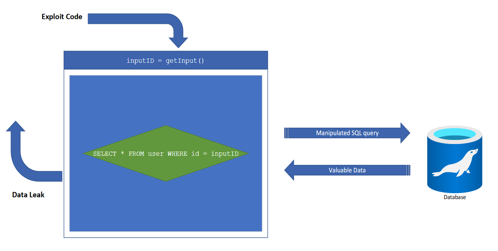

# Datenbank-Exploits - Angriffe auf die Datenbank

Ein großer Nachteil der direkt abgesetzten Queries ist, dass der Einsatz von Variablen zu Sicherheitsproblemen führen kann, weil der Inhalt der Variablen insbesondere von Variablen des Typs String gegen **Code-Injection** nicht geschützt sind. Code-Injection könnte folgendermaßen aussehen: 

In die Variable *`lastname`* könnte man statt `"Mair%"` sondern z.B. `"'Mair%' OR NOT LIKE 'Mair%'"` und so liefert das Statement auf einmal alle Einträge der Tabelle, statt ausschließlich jene, die eigentlich abgefragt werden sollen. Stellen Sie sich vor, was da passiert, wenn eine solche Abfrage auf der User-Tabelle stattfindet, die alle Benutzer\*innen ihrer Website beinhaltet: Der\*die Angreifer\*in bekommt , alle vorhandenen Benutzer\*innen-IDs und vermutlich noch einige sensible Informationen über diese.

Wie man an diesem Beispiel erkennen kann, können Angreifer\*innen aufgrund nicht abgesicherter Statements vieles anrichten. 

Ein anderes Beispiel wäre, dass der\*die Angreifer\*in die gesamte Datenbank löscht oder einem anderen User Rechte vergibt, einen neuen User anlegt, mit dem weiter angegriffen werden kann.

Der Kern des Problems ist, dass Code und Daten vermischt werden müssen, um zum Ergebnis zu kommen. Den Code hat der Entwickler in der Hand, allerdings hat meist der\*die Anwender\*in (also der\*die Angreifer\*in) die eingegebenen Daten in der Hand. Dieses Thema findet man aber nicht nur in der Arbeit mit Datenbanken. Auch *`Makros in Office-Dokumenten`*, *`Javascript in HTML/PDF`* sind Beispiele davon, wo Code-Injection ins Spiel kommen kann.

Weiters ist es für produktive Applikationen unbedingt notwendig, die Rechte des Datenbankusers so einzuschränken, dass dieser nur das tun darf, was er wirklich können soll. Auch die Quelle, wo die Anfrage herkommen darf (lokal vs. Internet vs. bestimmte IP-Adressen) soll möglichst eingeschränkt werden.

Ein User, der lediglich in der Datenbank `Users` Lese- und Schreiboperationen durchführen soll, soll auch ausschließlich diese Rechte haben (also hierfür den root-User zu verwenden, stellt eine Sicherheitslücke dar, die Angreifer\*innen mehr Angriffsmöglichkeiten bietet). Man könnte soweit gehen, dass man für eine Applikation mehrere Datenbankuser erstellt, die je nach Anwendungsfall verwendet werden.

**Zusammengefasst**:

Es gibt viele mögliche Wege Daten so zu manipulieren, um entweder mehr Daten aus der Datenbank herauszubekommen oder Daten zu löschen bzw. zu verändern. 

Was kann man dagegen tun:
- Quoting und Escaping
- PreparedStatements (siehe nächstes Kapitel)
- [SQL Injection Prevention Cheat Sheet](https://cheatsheetseries.owasp.org/cheatsheets/SQL_Injection_Prevention_Cheat_Sheet.html)
- Datenbankuser hat genau jene Rechte, die er wirklich braucht!
    - Am besten ein Frontend-User, der lediglich Daten abfragen darf
    - und ein Backend-User, der Schreibrechte erhält.
    - und ein eigener Benutzer für die Applikationsverwaltung, der CREATE TABLE usw. ausführen darf...
- Datenbankuser darf sich ausschließlich von dort aus einloggen, wo er herkommen darf (idealerweise localhost, ansonsten bestimmte IP-Adresse)