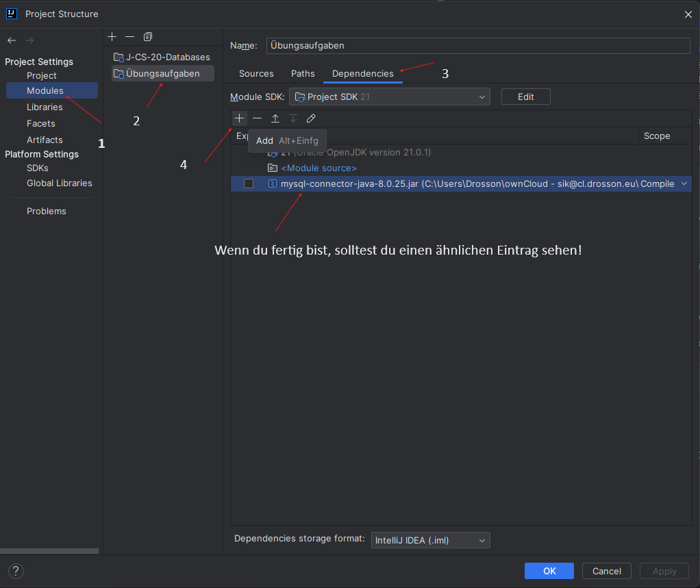
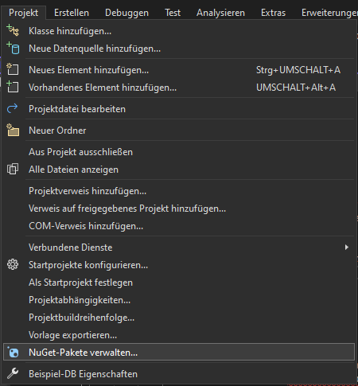

# Datenbankverbindung

Bevor wir anfangen zu coden, ist es wichtig, zu verstehen, wie die Arbeit mit Datenbanken grundsätzlich funktioniert.

Es gibt durchaus eine gewisse Ähnlichkeit zur Arbeit mit Dateien:
- Zuerst muss man sich mit der Datenbank verbinden. 
- Anschließend kann man Abfragen absetzen.
- Am Ende muss man die Verbindung wieder schließen.

Das ist doch sehr ähnlich wie bei der Arbeit mit Dateien, oder?

## Was ist eine Datenbank-Verbindung?

### Die Verbindungsinformationen

Eine Datenbank kann lokal laufen, aber genauso auf einem Server im Internet. Um diese erreichen zu können, muss man zuerst erfahren, wo diese liegt. 

Man spricht vom `Pfad zur Datenbank`. Dieser besteht aus der `URL zum Datenbankserver` inkl. des entsprechenden `Ports` (z.B. MySQL läuft häufig auf Port 3306) und aus dem `Pfad zur Datenbank am Server`.

Mit diesem Pfad kommt man bis zum Server hin, allerdings lässt dieser einen in der Regel noch nicht hinein. Kaum Datenbanken lassen den Zugriff von anonymen Benutzer:innen zu. Das wäre eine große Sicherheitslücke. Selbst eine interne Datenbank, die vom Internet aus nicht erreichbar ist, sollte vor Angriffen geschützt werden. Die Daten in der Datenbank sind ja in der Regel die ***Grundlage für das Geschäft***. Sie sind sehr viel wert. Daher ist die Absicherung dieser Daten die höchste Priorität! 

Der erste Schritt für diesen Schutz ist, den Zugriff aufgrund eines:er Benutzers:in auf den Datenbankserver einzuschränken. Weiters sollte auch innerhalb des Datenbankservers der Zugriff spezifisch eingeschränkt werden: sollte User A nur auf die Datenbank X einen Lesezugriff benötigen, dann bekommt dieser User auch nur für diese eine Datenbank einen Lesezugriff.

Dazu benötigen wir entsprechende `Zugangsdaten`. 

### Auswahl der Zugriffsmethode auf die Datenbank

Als Nächstes müssen wir uns für eine Methode entscheiden, wie wir mit der Datenbank arbeiten wollen:
- direkt mit dem Protokoll der Datenbank: diesen Weg wählen die wenigsten, da zu kompliziert und sehr spezifisch


- mit bestehenden Libraries, die verschiedene Datenbanken unterstützen (z.B. JDBC für Java)


Als Nächstes müssen wir uns für einen Treiber entscheiden. Je Datenbanktyp gibt es entsprechende Treiber. Dieser spielt die Rolle eines **Übersetzers von den Standardoperationen in die für diese eine Datenbank spezifische Sprache**. 

In unserem Beispiel verwenden wir eine MySQL-Datenbank. Welchen Treiber wir wählen hängt einerseits von der Programmiersprache ab, andererseits von der anzusprechenden Datenbank. Weiters kann man sich auch die Herangehensweise aussuchen: eine API, um SQL verwenden zu können oder ORM (Object Relationship Mapping), um die Datenbank als Objekt im Programm abzubilden.

### eine Datenbankverbindung herstellen in verschiedenen Programmiersprachen

Jetzt haben wir alle nötigen Daten, um unsere erste Verbindung zu erstellen. Dies erfolgt folgendermaßen:

#### Java

In Java kann man unter mehreren Möglichkeiten auswählen, wie wir mit der Datenbank interagieren wollen. 2 wichtige Möglichkeiten möchten wir hier erwähnen:
- `JDBC`: ist eine API, um mit der jeweiligen Datenbank (in unserem Beispiel MySQL) zu kommunizieren. Mit JDBC können wir SQL-Abfragen absetzen. Der Hauptvorteil von JDBC ist, dass es am Anfang einfacher ist, zu verstehen. Aus diesem Grund präsentieren wir es hier.
- `JPA`: ist eine Möglichkeit, die Datenbank in Objekten abzubilden. JPA ist ein Abstraktionslayer, das die Low Level-JDBC-Aufrufe versteckt und dadurch die Arbeit mit Datenbanken auf Dauer vereinfacht. Diese Methode kann im Rahmen einer Vertiefung erlernt werden.

##### Treiber einbinden

Bevor wir den entsprechenden Driver laden können, müssen wir für Projekte, deren Dependencies von Maven verwaltet werden, die entsprechende Dependency in das Projekt einbinden. Dies erfolgt in einem Maven-Projekt im *`pom.xml`*-File:

```xml
<dependencies>
    <dependency>
        <groupId>com.mysql</groupId>
        <artifactId>mysql-connector-j</artifactId>
        <version>[aktuelle Versionsnummer]</version>
    </dependency>
</dependencies>
```

In IntelliJ müssen wir nach der Eintragung die Dependencies aktualisiert werden. Das erkennt man daran, dass die eingefügte Dependency in roter Schrift dargestellt wird. 

Per Klick auf werden die Dependencies neu geladen.

Alternativ z.B. in IntelliJ-Projekten müssen wir den entsprechenden Driver einbinden. Dies erfolgt in der `Project Structure` (`Strg + Alt + Umschalt + S`) in den Modules-Dependencies:



ACHTUNG! Wird die Alternative Lösung in einem Projekt angewendet, besteht die Gefahr, dass diese Einbindung automatisch gelöscht wird, sobald die Dependencies der POM-Datei neu geladen werden.

##### Datenbankverbindung aufbauen

Anschließend können wir mit der Anbindung der Datenbank anfangen:

```java
// Java

import java.sql.*;
import java.io.*;

public class DBConnector{

    private String dbName = "db_name";
    private String username = "db_name_user";
    private String password = "pw_db_name_user";
    private String url = "jdbc:mysql://localhost:3306/" + dbName; //URL zum lokalen MySQL-Server und Datenbank db_name
    private static DBConnector connector = null;
    private Connection connection;
    
    public DBConnector(){
        try{
            Class.forName("com.mysql.cj.jdbc.Driver"); //Driver "com.mysql.cj.jdbc.Driver" laden
            connection = DriverManager.getConnection(url, username, password); // Verbindung mit der Datenbank herstellen und in Variable connection speichern
        } catch (Exception e){
            e.printStackTrace();
            throw new SQLException("Database Connection couldn't be established!", e);
        }
        connector = this;
    }

    public static Connection getInstance() throws SQLException {
        if (connector == null){
            connector = new DBConnector();
        } else if (connector.connection.isClosed()){
            connector = new DBConnector();
        }
        return connector.connection;
    }
}
```

#### C#

In C# gibt es genauso mehrere Varianten, wie auf eine Datenbank zugegriffen werden kann. Zwei der bekanntesten sind:
- *`SqlConnection`*: ist eine API, um mit der jeweiligen Datenbank (in unserem Beispiel MSSQL) zu kommunizieren. Mit *`SqlCommand`* können wir SQL-Abfragen absetzen. Der Hauptvorteil von *`SqlCommand`* ist, dass es am Anfang einfacher ist, zu verstehen und, dass genau das passiert, was der Entwickler anfordert. Aus diesem Grund präsentieren wir es hier.
- *`Linq`* Mit Linq kann man eine Datenbank in Objekten abbilden. Damit ist mehr automatisiert. Dies ist für Anfänger nicht optimal, um zu verstehen, wie die Arbeit mit Datenbank in C# erfolgt. Daher wird Linq hier nicht näher vorgestellt.

Da C# eine Programmiersprache von Microsoft ist, macht es Sinn auch seitens der Datenbank ein Microsoft-Produkt zu verwenden: [MSSQL Express/Developer](https://www.microsoft.com/de-at/sql-server/sql-server-downloads). Natürlich kann man mit C# auch eine MySQL- oder Oracle-Datenbank verwenden!

```csharp
// C# 
using System;
using System.Data.SqlClient;

namespace J_CS_20_CS_Aufgaben
{
    public class DBConnector
    {
        private static DBConnector connector = null;
        private String serverName = "My Server Name";
        private String dbName = "db_name";
        private String username = "db_user";
        private String password = "pw_db_user";
        private SqlConnection connection;

        public DBConnector()
        {
            try
            {
                string connectionString = "Data Source=" + serverName + ";Initial Catalog=" + dbName + ";User ID=" + username + ";Password=" + password + ";";
                connection = new SqlConnection(connectionString); // Verbindung mit der Datenbank herstellen und in Variable connection speichern
                connection.Open();
            }
            catch (Exception e)
            {
                e.ToString();
            }
            connector = this;
        }

        public static SqlConnection GetInstance()
        {
            if (connector == null)
            {
                connector = new DBConnector();
            }
            else if (connector.connection != null && connector.connection.State != System.Data.ConnectionState.Open)
            {
                connector = new DBConnector();
            }
            return connector.connection;
        }
    }
}
```
[SqlConnection: Dokumentation](https://learn.microsoft.com/de-de/dotnet/api/system.data.sqlclient.sqlconnection?view=dotnet-plat-ext-8.0)

Hier verwenden wir das Design Pattern `Singleton`.

Um `System.Data.SqlClient` verwenden zu können, muss es im Projekt heruntergeladen werden. Dies erfolgt am einfachsten mit der Paketverwaltung NuGet. Diese öffnet ihr hier:



Anschließend wird das Paket `System.Data.SqlClient` gesucht:


Schließlich wird das Paket installiert:


Danach informiert das System potenziell über Änderungen in der Lösung:


Zum Schluss müssen den Lizenzbestimmungen zugestimmt werden:


Mehr Informationen dazu findest du hier: [Refactoring.Guru: Singleton Design Pattern](https://refactoring.guru/design-patterns/singleton/java/example)

Zurück zur [Startseite](../README.md)
