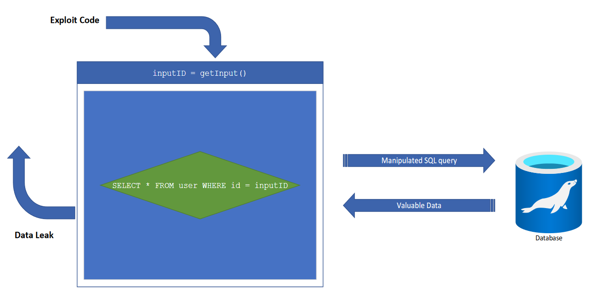
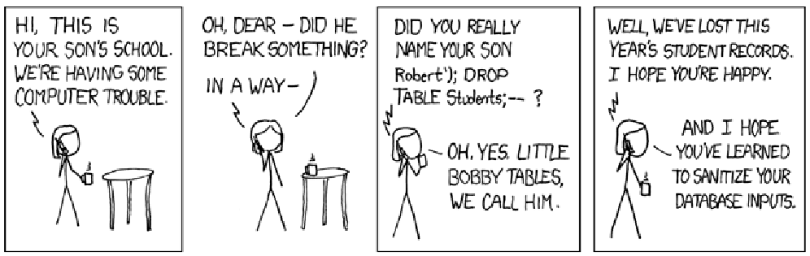

# Datenbank-Exploits - Angriffe auf die Datenbank

Ein großer Nachteil der direkt abgesetzten Queries ist, dass der Einsatz von Variablen zu Sicherheitsproblemen führen kann, weil der Inhalt der Variablen insbesondere von Variablen des Typs String gegen **Code-Injection** nicht geschützt sind. 

In Bezug auf Datenbanken-Requests geht es darum, dass einerseits der:die Entwickler:in nicht die volle Kontrolle über das abzusetzende SQL-Statement hat. Der:die Benutzer:in hat die Kontrolle über seine:ihre Eingabe und somit auf den Inhalt der Variablen, die in das SQL-Statement eingefügt werden. So kann er:sie versuchen, bewusst andere Eingaben zu tätigen, um die Einschränkungen des:r Entwickler:in zu umgehen. Man spricht hier von **Code-Injection**.

Code-Injection könnte folgendermaßen aussehen: 

In die Variable *`lastname`* könnte ein:e Benutzer:in statt `"Mair%"` z.B. `"'Mair%' OR NOT LIKE 'Mair%'"`. So würde das Statement auf einmal alle Einträge der Tabelle liefern, statt ausschließlich jene, die eigentlich abgefragt werden sollen. 

Stellen Sie sich vor, was da passiert, wenn eine solche Abfrage auf der User-Tabelle stattfindet, die alle Benutzer:innen ihrer Website beinhaltet. Der:die Angreifer:in bekommt, alle vorhandenen Benutzer:innen-IDs und vermutlich noch einige sensible Informationen dazu.

Wie man an diesem Beispiel erkennen kann, können Angreifer:innen aufgrund nicht abgesicherter Statements vieles anrichten. 

Ein anderes Beispiel wäre, dass der:die Angreifer:in die gesamte Datenbank löscht oder einem anderen User Rechte vergibt, einen neuen User anlegt, mit dem weiter angegriffen werden kann.

Der Kern des Problems ist, dass Code und Daten vermischt werden müssen, um zum Ergebnis zu kommen. Den Code hat der Entwickler in der Hand, allerdings hat meist der:die Anwender:in (also der:die Angreifer:in) die eingegebenen Daten in der Hand. Dieses Thema findet man aber nicht nur in der Arbeit mit Datenbanken. Auch *`Makros in Office-Dokumenten`*, *`Javascript in HTML/PDF`* sind Beispiele davon, wo Code-Injection ins Spiel kommen kann.

Ein wichtiger Schritt ist also, die Eingaben von Benutzer:innen sowohl client- als auch serverseitig zu überprüfen.

Weiters ist es für produktive Applikationen unbedingt notwendig, die Rechte des Datenbankusers so einzuschränken, dass dieser nur das tun darf, was er wirklich können soll. 

Ein User, der lediglich in der Datenbank `Users` Lese- und Schreiboperationen durchführen soll, soll auch ausschließlich diese Rechte haben (also hierfür den root-User zu verwenden, stellt eine Sicherheitslücke dar, die Angreifer:innen mehr Angriffsmöglichkeiten bietet). Man könnte so weit gehen, dass man für eine Applikation mehrere Datenbankuser erstellt, die je nach Anwendungsfall verwendet werden.

Auch die Quelle, wo die Anfrage herkommen darf (lokal vs. Internet vs. bestimmte IP-Adressen) soll möglichst eingeschränkt werden.

Zur Darstellung der Kreativität von Angreifer:innen hier ein Beispiel:

**Zusammengefasst**:

Es gibt viele mögliche Wege Daten zu manipulieren, um entweder mehr Daten aus der Datenbank herauszubekommen oder Daten aus der Datenbank zu löschen bzw. zu verändern. 

Was kann man dagegen tun:
- Quoting und Escaping
- PreparedStatements (siehe voriges Kapitel)
- [SQL Injection Prevention Cheat Sheet](https://cheatsheetseries.owasp.org/cheatsheets/SQL_Injection_Prevention_Cheat_Sheet.html)
- Datenbankuser hat genau jene Rechte, die er wirklich braucht!
    - Am besten ein Frontend-User, der lediglich Daten abfragen darf
    - und ein Backend-User, der Schreibrechte erhält.
    - und ein eigener Benutzer für die Applikationsverwaltung, der CREATE TABLE usw. ausführen darf ...
- Datenbankuser darf sich ausschließlich von dort aus einloggen, wo er herkommen darf (idealerweise localhost, ansonsten bestimmte IP-Adresse/n)